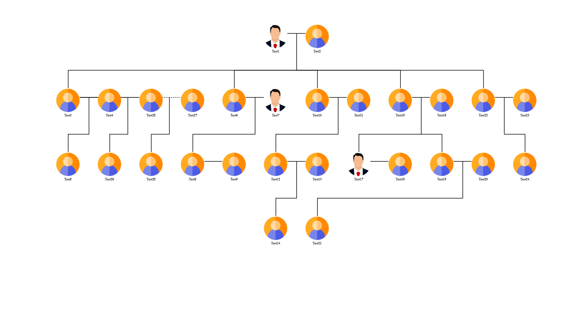

<br/>
<p align="center">
  <h3 align="center">Family Tree Generator</h3>

  <p align="center">
    A simple family tree generator using fabric.js
    <br/>
    <br/>
  </p>
</p>

     

## About The Project



There are many great libraries out there to build a tree structure in Javascript. But none of them were simple use or in my case let you build a family tree specifically with multiple scenarios; such as supporting more than one partners or step/foster/adopted children. 

This simple tree generator takes your JSON data and builds a family tree using fabricjs on a HTML canvas. 

## Built With

Vanilla Typescript with [fabricjs](http://fabricjs.com/) and packaged using [Vite](https://vitejs.dev/).

## Getting Started


### Installation

```
npm install npm@family-tree-generator
```

## Usage

TODO

### Creating A Pull Request


## License

Distributed under the MIT License. See [LICENSE](https://github.com/shenoyranjith/family-tree-generator/blob/main/LICENSE.md) for more information.

## Authors

* **Ranjith R Shenoy** - *An enthusiastic software developer* - [Ranjith R Shenoy](https://github.com/shenoyranjith/)
